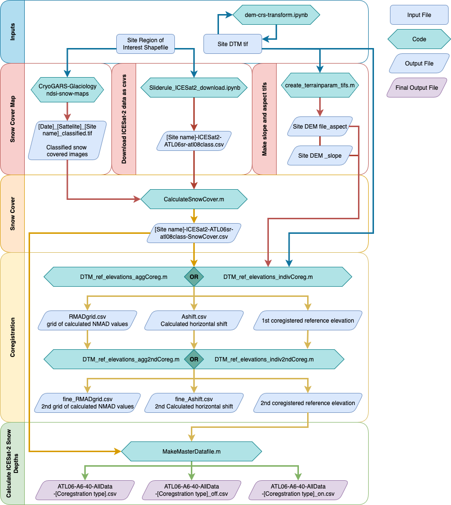

# ICESat2-AlpineSnow
ICESat-2 derived snow depth workflow for alpine watersheds. 


This workflow calculates snow depth by comparing snow-on ICESat-2 observations to a independently colected snow-free reference DTM. 

This repository contains codes to: 
- Download ICESat-2 ATL06 data from ATL08 ground classified photons from an ROI with a desired CRS using the Sliderule-Earth data processing package
- Transform a reference DTM raster to a desired ROI
- Classify ICESat-2 segments as snow-free or snow covered using a snow cover map
- Coregister ICESat-2 transects and a snow-free reference DTM using either agregated or individual ICESat-2 overpasses
- Calculate comparitive snow depth from coregistered ICESat-2 returns and snow-free DTMs
- Calculate and apply slope corrections to ICESat-2 snow depths

To make snow cover maps we used [CryoGARS-Glaciology/ndsi-snow-maps](https://github.com/CryoGARS-Glaciology/ndsi-snow-maps)

## Correspondence
Karina Zikan (karinazikan@u.boisestate.edu)

# Directory set up
These codes expect the following intital directory set up. 

```
├── codes.m
├── codes.ipynb
├── README.md
└── Sites
    └── [Site name]
        └── DEMs
            ├── [snow free reference DTM raster]
            ├── [slope raster]
            ├── [aspect raster]
        └── IS2_Data
        └── ROIs
            ├── [ROI shapefile]
        └── snotel
            ├── [AWS snow depth time series csv]
        └── SnowCover
            ├── [Snow cover map tifs. file names must start with date: yyyy-mm-dd]
```

# Workflow 
 
